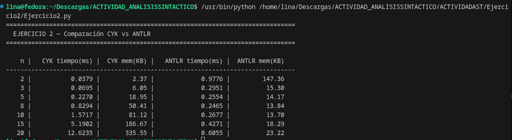

# Ejercicio 2 — Comparación CYK vs ANTLR


---

## ¿Qué hace?

Compara dos algoritmos de análisis sintáctico midiendo **tiempo de ejecución (ms)** y **memoria pico (KB)** con el módulo `tracemalloc` de Python, para cadenas de longitud creciente:

| Algoritmo | Complejidad tiempo | Complejidad memoria | Tipo |
|-----------|--------------------|---------------------|------|
| **CYK**   | O(n³ · \|G\|)      | O(n² · \|V\|)       | Bottom-up, cualquier GLC en FNC |
| **ANTLR** | O(n) en práctica   | O(n)                | LL(*), gramáticas bien formadas |

---

## Gramáticas utilizadas

### CYK — Forma Normal de Chomsky (FNC)

CYK requiere que todas las producciones sean `A → BC` o `A → a`:

```
S  →  a  |  S A
A  →  OP S
OP →  +  |  -  |  *  |  /
```

### ANTLR — Archivo `Ejercicio2.g4`

ANTLR acepta gramáticas EBNF directamente:

```antlr
grammar Ejercicio2;

s    : expr ;
expr : term (( '+' | '-' ) term)* ;
term : factor (( '*' | '/' ) factor)* ;
factor : 'a' | '(' expr ')' ;
WS   : [ \t\r\n]+ -> skip ;
```

---

## Funciones

Este ejercicio no usa clases propias: ANTLR genera sus propias clases (`Ejercicio2Lexer`, `Ejercicio2Parser`) automáticamente a partir del archivo `.g4`. El código de `Ejercicio2.py` solo las invoca.

| Función | Descripción |
|---------|-------------|
| `cyk_process(tokens, gram)` | Ejecuta el algoritmo CYK completo sobre una lista de tokens usando la gramática FNC recibida como diccionario. Construye la tabla triangular `tabla[i][j]` — un conjunto de no-terminales que derivan la subcadena `tokens[i..j]`. Tiene tres bucles anidados: longitud de subcadena, posición de inicio, y punto de partición `k`. Retorna `True` si `"S"` aparece en `tabla[0][n-1]`, es decir, si la cadena completa pertenece al lenguaje. |
| `generar_cadena(n)` | Genera una cadena de prueba con `n` operandos `"a"` separados por operadores aleatorios (+, -, *, /). Devuelve dos versiones: la lista de tokens para CYK y la cadena de texto para ANTLR. |
| `medir_cyk(tokens)` | Llama a `cyk_process` midiendo el tiempo con `time.perf_counter()` y la memoria pico con `tracemalloc`. Retorna `(tiempo_ms, memoria_kb)`. |
| `medir_antlr(cadena)` | Construye el pipeline completo de ANTLR: `InputStream` → `Ejercicio2Lexer` → `CommonTokenStream` → `Ejercicio2Parser` → llama a `parser.s()`. Mide tiempo y memoria de todo el proceso. Retorna `(tiempo_ms, memoria_kb)`. |

---

## Clases generadas por ANTLR

Estos archivos son generados automáticamente por ANTLR a partir del `.g4` y no deben editarse manualmente:

| Archivo | Descripción |
|---------|-------------|
| `Ejercicio2Lexer.py` | Analizador léxico generado. Convierte la cadena de texto en una secuencia de tokens reconociendo los literales `'a'`, `'+'`, `'-'`, `'*'`, `'/'`, `'('`, `')'` y descartando espacios. |
| `Ejercicio2Parser.py` | Analizador sintáctico generado. Contiene los métodos `s()`, `expr()`, `term()` y `factor()` que corresponden directamente a las reglas del archivo `.g4`. Implementa un autómata LL(*) que decide qué producción aplicar mirando hacia adelante los tokens necesarios. |
| `Ejercicio2Listener.py` | Interfaz de visitante generada. Define los métodos `enterXxx` y `exitXxx` para recorrer el árbol de análisis mediante el patrón Listener (no se usa en este ejercicio). |

---

## Requisitos

```bash
pip install antlr4-python3-runtime
```

Los archivos generados ya están incluidos en el repositorio. Si se modifica el `.g4`, regenerar con:

```bash
antlr4 -Dlanguage=Python3 Ejercicio2.g4
```

---

## Cómo ejecutar

```bash
cd Ejercicio2/
python3 Ejercicio2.py
```

---

## Resultados obtenidos

| n  | CYK tiempo(ms) | CYK mem(KB) | ANTLR tiempo(ms) | ANTLR mem(KB) |
|----|----------------|-------------|------------------|---------------|
| 2  | 0.0379         | 2.37        | 0.9776           | 147.36        |
| 3  | 0.0695         | 6.05        | 0.2951           | 15.30         |
| 5  | 0.2270         | 18.95       | 0.2554           | 14.17         |
| 8  | 0.8294         | 50.41       | 0.2465           | 13.84         |
| 10 | 1.5717         | 81.12       | 0.2677           | 13.70         |
| 15 | 5.1902         | 186.67      | 0.4271           | 18.29         |
| 20 | 12.6235        | 335.55      | 0.6055           | 23.22         |

**Observaciones:**
- El tiempo CYK se multiplica ~8x cada vez que n se duplica (consistente con O(n³)).
- La memoria CYK crece en O(n²): de 18.95 KB (n=5) a 335.55 KB (n=20), factor ~17.7x.
- ANTLR tiene memoria casi constante (~14-23 KB) porque su tabla de análisis es fija.

---

## Captura de ejecución



---

## Conclusión

CYK es un algoritmo universal que funciona con cualquier gramática libre de contexto en FNC, pero su costo cúbico lo hace impráctico para entradas reales. ANTLR implementa LL(*), que es O(n) en la práctica para gramáticas bien estructuradas. Los compiladores reales (GCC, Clang, javac) siempre usan algoritmos LL o LR, nunca CYK.

---

## Estructura del código

```
Ejercicio2/
├── Ejercicio2.g4            # Gramática ANTLR (fuente, editable)
├── Ejercicio2.py            # Script principal de comparación
│   ├── def cyk_process()    # Algoritmo CYK: tabla n×n con programación dinámica
│   ├── def generar_cadena() # Genera cadena de prueba de n operandos
│   ├── def medir_cyk()      # Mide tiempo y memoria de CYK
│   └── def medir_antlr()    # Mide tiempo y memoria de ANTLR
├── Ejercicio2Lexer.py       # Generado por ANTLR: tokenizador
├── Ejercicio2Parser.py      # Generado por ANTLR: parser LL(*)
└── Ejercicio2Listener.py    # Generado por ANTLR: patrón Listener (no usado)
```