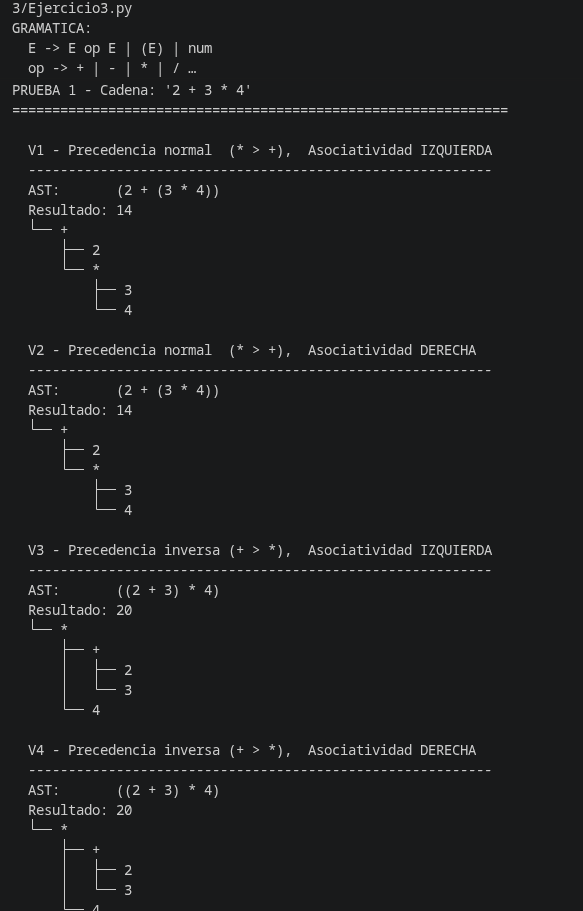
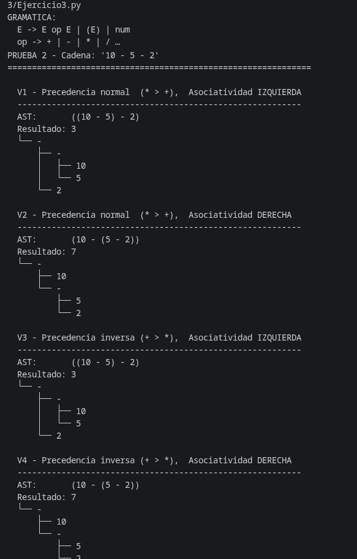

# Ejercicio 3 — Precedencia y Asociatividad

---

## ¿Qué hace?

Implementa cuatro versiones de una gramática aritmética, cada una con una combinación distinta de **precedencia de operadores** y **asociatividad**. Se aplica la misma cadena de entrada a las cuatro versiones y se comparan los árboles ASD y los valores obtenidos, demostrando cómo estas dos propiedades de la gramática determinan completamente la estructura del árbol de análisis.

---

## Gramática base

```
E  →  E op E  |  (E)  |  num
op →  +  |  -  |  *  |  /
```

LEn este ejercicio también se construye un árbol de sintaxis (ASD). 
Sin embargo, a diferencia del Ejercicio 1, la estructura es binaria, ya que cada operador tiene un operando izquierdo y uno derecho. 

Esto permite representar claramente cómo la precedencia y la asociatividad afectan la forma del árbol, manteniendo la estructura esencial de la derivación.

---

## Las cuatro gramáticas

| Versión | Precedencia       | Asociatividad | `2+3*4` | `10-5-2` |
|---------|-------------------|---------------|---------|----------|
| V1      | normal  (* > +)   | Izquierda     | 14 ✓    | 3 ✓      |
| V2      | normal  (* > +)   | Derecha       | 14      | 7        |
| V3      | inversa (+ > *)   | Izquierda     | 20      | 3        |
| V4      | inversa (+ > *)   | Derecha       | 20      | 7        |

```python
PREC_V1 = {'+': (1,'L'), '-': (1,'L'), '*': (2,'L'), '/': (2,'L')}
PREC_V2 = {'+': (1,'R'), '-': (1,'R'), '*': (2,'R'), '/': (2,'R')}
PREC_V3 = {'+': (2,'L'), '-': (2,'L'), '*': (1,'L'), '/': (1,'L')}
PREC_V4 = {'+': (2,'R'), '-': (2,'R'), '*': (1,'R'), '/': (1,'R')}
```

---

## Clases y funciones

### `class Nodo`

Representa un nodo en el árbol de sintaxis (ASD).

---

### `class ParserPratt`

Implementa el algoritmo **Pratt parser**. Es el núcleo del ejercicio: al cambiar la tabla de precedencia que recibe, produce árboles completamente distintos para la misma entrada.

---


## Cómo ejecutar

```bash
python3 Ejercicio3.py
```

---

## Resultados

### Prueba 1 — `2 + 3 * 4` (efecto de la precedencia)

```
V1 (* > +, izq):  AST: (2 + (3 * 4))   Resultado: 14  <- estándar
V2 (* > +, der):  AST: (2 + (3 * 4))   Resultado: 14
V3 (+ > *, izq):  AST: ((2 + 3) * 4)   Resultado: 20  <- suma primero
V4 (+ > *, der):  AST: ((2 + 3) * 4)   Resultado: 20
```

Con un solo operador de cada tipo, la asociatividad no cambia el resultado. Lo que distingue es la **precedencia**.

### Prueba 2 — `10 - 5 - 2` (efecto de la asociatividad)

```
V1 (* > +, izq):  AST: ((10 - 5) - 2)   Resultado:  3  <- estándar
V2 (* > +, der):  AST: (10 - (5 - 2))   Resultado:  7
V3 (+ > *, izq):  AST: ((10 - 5) - 2)   Resultado:  3
V4 (+ > *, der):  AST: (10 - (5 - 2))   Resultado:  7
```

Con un solo tipo de operador, la precedencia no distingue. Lo que cambia es la **asociatividad**.

---

## Capturas de ejecución

**Prueba 1 — cambio de precedencia:**



**Prueba 2 — cambio de asociatividad:**



---

## Estructura del código

```
Ejercicio3.py
├── PREC_V1 / V2 / V3 / V4  # Las 4 tablas de precedencia configurables
├── class Nodo               # Nodo binario del ASD (valor + izq + der)
│   
├── def lexer()              # Tokenizador: texto → lista de tokens
├── class ParserPratt        # Parser Pratt con binding powers
│  
├── def evaluar()            # Evalúa el AST numéricamente de forma recursiva
└── def imprimir()           # Imprime el árbol con conectores ├── └──
```